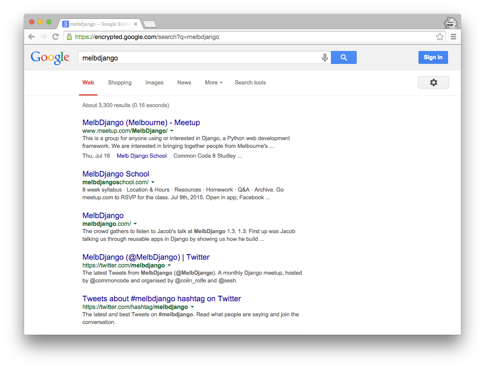

### MelbDjango School Lesson One

Introduction to MelbDjango School  
What are web applications?

---

### Course Basics

- Beginner and intermediate Django topics
- 8 weeks of classes
- Homework!
- Two assignments
- Demo day to show off your project
- Bring your laptop. Show us what you're doing!

---

### Course Basics

- Everything runs through Github
  - https://github.com/MelbDjango

- Or find additional resources on our site
  - http://melbdjangoschool.com

---

### Today's Class

- HTTP, Requests and Responses
- Getting Python, virtualenv and Django installed
- Our first Django project
- Introduction to Git and Github

---

So, how do web apps work?

---

### HTTP: Hyper Text Transfer Protocol

- The language we communicate with on the Internet
- Defined in 1989 by Sir Tim Berners-Lee and his team at CERN
- Clients use HTTP to request resources from servers

---


---

# TODO: Diagram of clients and servers

---

### Request and Response

- When a user enters a domain in their browser the browser sends a HTTP Request
- The HTTP Request traverses the internet until it reaches the desired server
- The server on the other end responds with a HTTP Response
- Our browser transforms the response into the visual representation of the website

---



---

### The HTTP Request

```
  GET /melbdjango HTTP/1.1
  Accept: */*
  Accept-Encoding: gzip, deflate
  Connection: keep-alive
  Host: github.com
  User-Agent: HTTPie/0.9.2
```

- There are seven (main) methods of HTTP Request:
  - GET, HEAD, PATCH, POST, PUT, OPTIONS, DELETE
  - Some of these are expected to change something on the server (POST, PATCH, PUT, DELETE)
  - And some of them aren't (GET, HEAD, OPTIONS)

---

### The HTTP Request Line

```
  GET /melbdjango HTTP/1.1
  Accept: */*
  Accept-Encoding: gzip, deflate
  Connection: keep-alive
  Host: github.com
  User-Agent: HTTPie/0.9.2
```

- URI: The resource you're requesting `/melbdjango`
- Protocol: The version of HTTP you'd like to use `HTTP/1.1`

---

### HTTP Headers

- Key/value pairs that define our Request and Response
- In our GET Request we can see:
  - `Accept` - defines what types we're happy to accept in the response
  - `Accept-Encoding` - the encodings (normally, compression) we're able to handle
  - `Connection` - control options for our connection to the server
  - `Host` - domain name of the server
  - `User-Agent` - a string that tells the server information about our client

---

### HTTP Body

# TODO: Brenton

---

### The HTTP Response

```
  HTTP/1.1 200 OK
  Connection: keep-alive
  Content-Encoding: gzip
  Content-Type: text/html
  Date: Mon, 13 Jul 2015 02:17:53 GMT
  Last-Modified: Fri, 29 May 2015 03:33:24 GMT
  Server: nginx/1.6.2 (Ubuntu)
```

- HTTP Responses always have a status code
  - (1xx Informational)
  - 2xx Successful
  - 3xx Redirection
  - 4xx Client Error
  - 5xx Server Error

---

### The HTTP Response

```
  HTTP/1.1 200 OK
  Connection: keep-alive
  Content-Encoding: gzip
  Content-Type: text/html
  Date: Mon, 13 Jul 2015 02:17:53 GMT
  Last-Modified: Fri, 29 May 2015 03:33:24 GMT
  Server: nginx/1.6.2 (Ubuntu)
```

  - And a Content-Type
    - text/html, image/jpeg, application/json

---

What is Django? Why Django?

---

### Installing Python

- We're going to use Python 3.4

- Linux / Mac OSX:
  - Awesome! You've already got Python but you might need to update it
  - Run `python --version` or `python3 --version`
  - Use your package manager to update Python if needed
    - Ubuntu/Debian: `sudo apt-get install python3.4`
    - Mac OSX: `brew install python3.4`

---

### Installing Python

- Windows:
  - Head to python.org and download Python 3.4.3
  - https://www.python.org/downloads/release/python-343/

- We can help! Hang back after class.

---

### pip: Installs Python Packages

- Comes with Python 3
- Install packages with `pip install -U <package-name>`
  - `-U` forces pip to install the latest available version
- Install a list of packages with `pip install -r <requirements-file>`
- Update pip with `pip install -U pip`

---

**Wait, I don't have pip!**

That's okay, there's a nice easy installation script available:
https://bootstrap.pypa.io/get-pip.py

Download that to a file and then run it with Python 3:

```
curl https://bootstrap.pypa.io/get-pip.py > get-pip.py
python3 get-pip.py
```

---

### Installing virtualenv

- virtualenv creates isolated Python environments
- Allows us to define consistent environments for development, testing and production
- You'll want a new virtualenv for every Python project you development

```
[sudo] pip install -U virtualenv
```

---

### Creating your first virtualenv

```
cd <my-project-name>
virtualenv -p python3 <my-project-name>
source <my-project-name>/bin/activate

```

---

### Installing Django

- After all that, installing Django is remarkably easy (just make sure your virtualenv is activated)
  - `pip install -U Django`

- This will install the latest version of Django and add the `django-admin` command

---

### Creating your first Django project

- Now that we've got Django installed, let's create our first project!
  - `django-admin startproject <project-name>`

---

### Django Project Structure

```
  timetracker/
  ├── manage.py
  └── timetracker
      ├── __init__.py
      ├── settings.py
      ├── urls.py
      └── wsgi.py
```

`./timetracker` is the name of your project and the **project workspace**, the `manage.py` file indicates that you're
at the root of your Django project.

`./timetracker/timetracker` is your **project module**, Django imports your project settings from here.

`./timetracker/manage.py` is a Python script used to manage your Django site.

`./timetracker/settings.py` is where Django loads your project configuration from.

`./timetracker/urls.py` is the default location

---

Pick a text editor

- We're going to use a basic text editor in class
- Check out atom.io, Sublime Text or Visual Studio Code (or vi / emacs if you're that way inclined)
- Avoid fully-blown IDEs for now (PyCharm, JetBrains, Eclipse) while we're learning

---

git Basics

For now, you'll only need four git commands:
  - git pull
  - git add
  - git commit
  - git push
